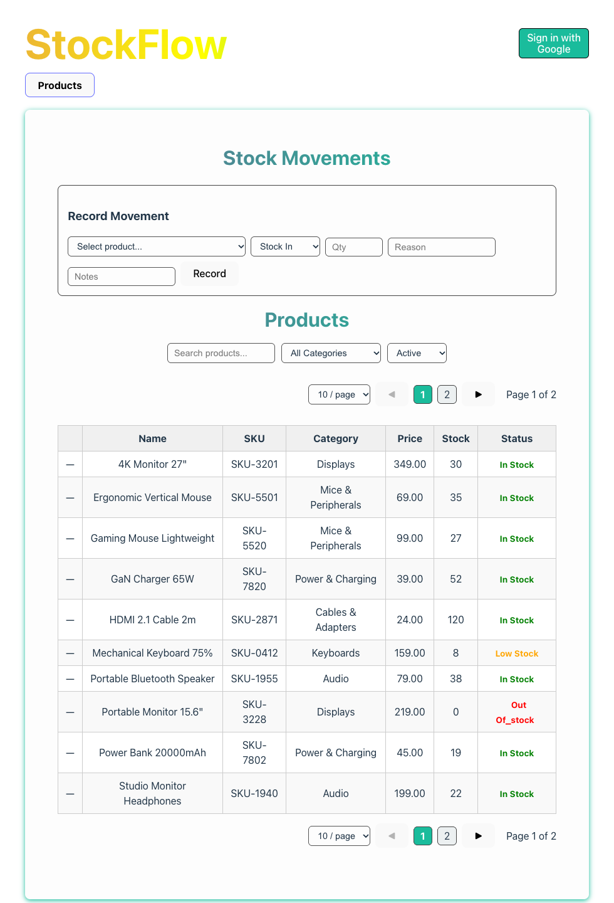

# 📦 StockFlow — Inventory and Order Management

A full-stack inventory app with a **PHP REST API** and a **React** front end. Staff can manage products and stock, handle orders, see a dashboard of low-stock items, and use AI (Google Gemini) to write product descriptions and reorder advice.

Built during a PHP course in spring 2026. The course gave a starter project with the routes stubbed out; **I implemented the backend routes and finished the front-end pages** (see [My part](#my-part)).

> 📌 The finished version is on the [`final_task`](https://github.com/BitaYeganeh/StockFlow/tree/final_task) branch.

**🌐 Live demo:** [stockflow-7o1k.onrender.com](https://stockflow-7o1k.onrender.com) *(free hosting: the first load can take up to a minute while the API wakes up; sign in with Google to add products and orders)*

---

<p align="center"></p>

---

## ✨ Features

| Area | What it does |
| --- | --- |
| **Products** | List with search and pagination, create, edit, delete, image upload, stock status |
| **Orders** | Create orders with several products, view details, change status with rules: `draft → confirmed → fulfilled`, or `cancelled` |
| **Stock** | Record stock movements (in / out / adjustment) and see the history |
| **Dashboard** | Totals for products, stock value, orders and revenue, plus the 5 most urgent low-stock products |
| **AI (Gemini)** | Generate a product description, get stock reorder advice, summarise recent orders |
| **Login** | Google sign-in through Supabase Auth; write actions need a logged-in user |

---

## 🛠 Tech stack

- **Backend:** PHP 8.1+, [Slim 4](https://www.slimframework.com/) router, Composer, `vlucas/phpdotenv`
- **Database and auth:** [Supabase](https://supabase.com/) (PostgreSQL with row-level security, Google OAuth)
- **AI:** Google Gemini API
- **Frontend:** React 19, Vite, Axios

```
React (Vite)  ──HTTP/JSON──►  PHP API (Slim 4)  ──►  Supabase (database + auth)
localhost:5173                localhost:8005    └──►  Google Gemini (AI)
```

---

## 🔌 API endpoints

All routes are in [`stockflow/api/src/Routes/`](stockflow/api/src/Routes).

| Method | Route | Purpose |
| --- | --- | --- |
| GET | `/api/products`, `/api/products/{id}` | List (search, pagination) and get one product |
| POST / PUT / DELETE | `/api/products`, `/api/products/{id}` | Create, update and delete products |
| POST | `/api/products/upload-image` | Upload a product image |
| GET / POST | `/api/orders`, `/api/orders/{id}` | List, view and create orders |
| PUT | `/api/orders/{id}/status` | Change order status (only allowed steps) |
| GET / POST | `/api/stock/movements` | Stock history and new stock movements |
| GET | `/api/dashboard/summary` | Dashboard numbers and low-stock list |
| POST | `/api/ai/describe`, `/api/ai/stock-advice`, `/api/ai/summarize-orders` | AI features |
| GET | `/api/auth/login-url`, `/api/auth/user` | Google login and current user |

---

## 👩‍💻 My part

The starter code (by the course teacher) had the app structure, login and stubbed routes. I built:

- **Backend routes:** products (full CRUD, search, pagination, image upload), orders (creation with line items, status rules), stock movements, dashboard summary and the three AI routes
- **Gemini client:** picks an available model automatically to avoid "model not found" errors ([`GeminiAI.php`](stockflow/api/src/AI/GeminiAI.php))
- **Front end:** finished the product form, order form and list, stock movements page, dashboard and AI panel, and styled the pages
- **Setup:** `.env.example` so the project can be run without sharing keys
- **Deployment:** made it run live on Render (see below)

### Bugs found and fixed while deploying

- Every product showed **"Uncategorized"**: the API read Supabase's joined category as a list, but it is a single object
- Uploaded **product images did not load** in the browser: the API saved `/uploads/...` paths relative to the API, so the React app looked for them on its own address. New uploads now get the full API address, and older paths are fixed in the app
- The API **crashed without a `.env` file** (as on a server); it now also reads settings from the environment
- The developer test page `test.php` **showed parts of the keys** and is no longer shipped; error details are hidden in production

---

## 🚀 Run locally

The live version runs on Render from [`render.yaml`](render.yaml): the PHP API as a Docker service and the React app as a static site.


You need PHP 8.1+, Composer, Node.js and a Supabase project (plus a Gemini API key for the AI features).

```bash
# 1. Environment variables
cp .env.example stockflow/api/.env   # then fill in your Supabase and Gemini keys
```

```bash
# 2. Backend (http://localhost:8005)
cd stockflow/api
composer install
php -S localhost:8005 -t public/
```

```bash
# 3. Frontend (http://localhost:5173), in a second terminal
cd stockflow/client/@
npm install
npm run dev
```

Exercise notes and the Supabase setup steps are in [`stockflow/TASKS.md`](stockflow/TASKS.md), and the data flow is explained in [`stockflow/ARCHITECTURE.md`](stockflow/ARCHITECTURE.md).

---

## ☁️ Deployment

StockFlow runs on [Render](https://render.com) from [`render.yaml`](render.yaml):

| Service | What | Address |
| --- | --- | --- |
| `stockflow` | React app (static site) | [stockflow-7o1k.onrender.com](https://stockflow-7o1k.onrender.com) |
| `stockflow-api` | PHP API (Docker, Apache) | [stockflow-api-7f6d.onrender.com](https://stockflow-api-7f6d.onrender.com/api/products) |

The two services find each other through their Render host names. Secrets (`SUPABASE_URL`, `SUPABASE_ANON_KEY`, `GEMINI_API_KEY`) are set in the Render dashboard, never in the repository. Google sign-in needs the site's `/auth/callback` address in Supabase → Authentication → URL Configuration.

---

## 📁 Repository layout

| Folder | What it is |
| --- | --- |
| [`stockflow/api/`](stockflow/api) | PHP REST API (Slim 4) |
| [`stockflow/client/@/`](stockflow/client/@) | React front end |
| [`phpDir/`](phpDir) | Earlier PHP lessons (plain PHP pages, run with Docker) |
| [`docker-compose.yml`](docker-compose.yml) | Docker setup for the PHP lessons (Apache, MySQL, phpMyAdmin) |

---

## 👤 Author

**Bita Yeganeh** · [GitHub](https://github.com/BitaYeganeh) · [Portfolio](https://myportfolio-u7mw.onrender.com)
